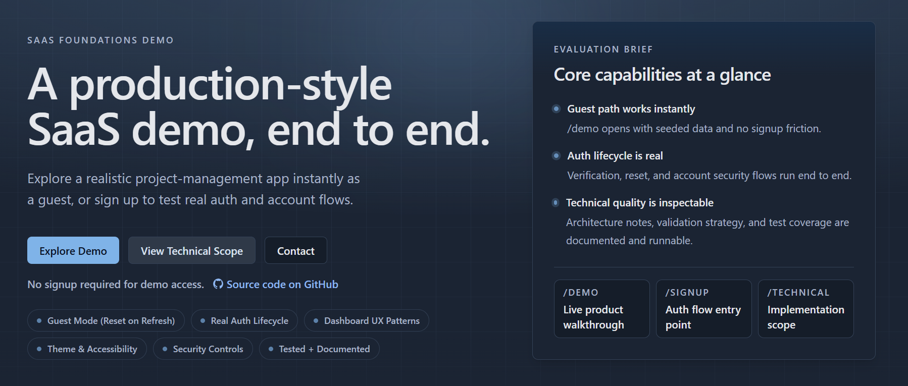

# SaaS Foundations Demo

Portfolio-grade Next.js SaaS demo application that showcases the foundations of a modern product build: marketing pages, a guest-accessible demo, authenticated account flows, testing, documentation, and production-minded operational defaults.

> Review-only repository.
> This repository is published publicly so prospective clients and technical reviewers can inspect the implementation. External contributions are not accepted, and no license is granted for reuse, modification, or redistribution without prior written permission.

## Live Site

- Marketing site: https://www.saasfoundationsdemo.com/
- Demo walkthrough: https://www.saasfoundationsdemo.com/demo
- Technical scope: https://www.saasfoundationsdemo.com/technical



## What This Project Is

SaaS Foundations Demo is intentionally a "skeleton SaaS" product. It is not presented as a real business product with full commercial scope. It exists to demonstrate that the underlying engineering standards are real:

- polished marketing and dashboard UI patterns
- guest and authenticated product flows
- email/password authentication lifecycle
- abuse prevention and secure defaults
- documentation, testing, and CI discipline

The same codebase powers a live public deployment and the public review repository.

## Current Scope

### Implemented

- public marketing site and technical/product pages
- guest demo experience with seeded data and reset-on-refresh behavior
- authenticated app routes with persisted user data
- email/password authentication lifecycle
- email verification, password reset, change email, and change password flows
- consent capture and audit persistence with replay handling
- health endpoints, SEO metadata, sitemap, robots, and IndexNow support
- rate limiting, bot protection hooks, and production-oriented configuration
- unit, integration, E2E, and visual regression coverage
- CI workflows and supporting project documentation

### Planned / Not Yet Implemented

- Stripe billing and webhook flows remain planned roadmap scope
- billing-related behavior appears in the PRD as intended direction, not current shipped functionality

## Review Path

If you are evaluating the repository, start here:

- [Reviewer Guide](./docs/REVIEWER_GUIDE.md)
- [PRD](./docs/PRD.md)
- [Architecture](./docs/architecture.md)
- [Decisions](./docs/decisions.md)
- [Theme Tokens](./docs/theme-tokens.md)

## Technical Highlights

- Next.js App Router
- TypeScript
- React 19
- Prisma + Postgres
- Auth.js credentials auth
- Argon2id password hashing
- Upstash-backed rate limiting
- Cloudflare Turnstile integration hooks
- Vitest + React Testing Library
- Playwright E2E and visual regression coverage
- GitHub Actions CI

## Repository Policy

- This is a review/showcase repository, not an open-source collaboration repo.
- External pull requests, issues, feature requests, and support requests are not part of the maintenance model.
- Security reports should be sent privately as described in [SECURITY.md](./SECURITY.md).
- General support and contact expectations are documented in [SUPPORT.md](./SUPPORT.md).
- Contribution expectations are documented in [CONTRIBUTING.md](./CONTRIBUTING.md).
- Usage rights are documented in [LICENSE.md](./LICENSE.md).

## Local Setup

### Prerequisites

- Node.js 24.12.0 (see `.nvmrc`)
- pnpm 10.27.0 (see `packageManager` in `package.json`)
- Docker and Docker Compose (for local Postgres)

Use Volta or Corepack to install the pinned pnpm version. With Corepack:

```bash
corepack enable
```

### Start the App

1. `pnpm install`
2. `docker compose up -d`
3. Create `.env.local` from `.env.example`
4. `pnpm dev`

After setup, open `http://localhost:3000`.

For database setup details, see [Architecture Documentation](./docs/architecture.md#local-development-setup).

## Available Scripts

| Script                     | Description                                                         |
| -------------------------- | ------------------------------------------------------------------- |
| `pnpm dev`                 | Start development server                                            |
| `pnpm build`               | Build for production                                                |
| `pnpm check:deploy-env`    | Validate preview/production deployment env contract                 |
| `pnpm start`               | Start production server                                             |
| `pnpm lint`                | Run ESLint                                                          |
| `pnpm format`              | Format code with Prettier                                           |
| `pnpm format:check`        | Check code formatting                                               |
| `pnpm typecheck`           | Run TypeScript type checking                                        |
| `pnpm test`                | Run unit tests (one-shot)                                           |
| `pnpm test:watch`          | Run unit tests in watch mode                                        |
| `pnpm test:e2e`            | Run Playwright E2E tests (chromium)                                 |
| `pnpm test:e2e:snapshots`  | Update + verify visual snapshots with `--scope` and `--target` args |
| `pnpm test:e2e:theme`      | Run theme-focused Playwright tests                                  |
| `pnpm seo:indexnow:submit` | Submit public URLs to IndexNow                                      |
| `pnpm theme:check`         | Validate theme tokens and semantic style rules                      |
| `pnpm db:generate`         | Generate Prisma client                                              |
| `pnpm db:migrate`          | Run Prisma development migrations                                   |
| `pnpm db:reset`            | Reset database via Prisma                                           |
| `pnpm db:seed`             | Seed database data                                                  |
| `pnpm db:studio`           | Open Prisma Studio                                                  |

## Environment Variables

See [`.env.example`](./.env.example) for the full set of configuration values.

Production-critical categories include:

- database: `DATABASE_URL`
- auth and token hashing: `AUTH_SECRET`, `TOKEN_HASH_SECRET`
- application URL: `NEXT_PUBLIC_APP_URL`
- email and contact metadata: `RESEND_API_KEY`, `EMAIL_FROM`, `SUPPORT_EMAIL`, `PUBLIC_CONTACT_EMAIL`, `LEGAL_CONTACT_EMAIL`
- readiness and cron protection: `READINESS_SECRET`, `CRON_SECRET`
- consent signing: `CONSENT_AUDIT_SIGNING_SECRET`
- rate limiting: `UPSTASH_REDIS_REST_URL`, `UPSTASH_REDIS_REST_TOKEN` (or Vercel/Upstash integration aliases `KV_REST_API_URL`, `KV_REST_API_TOKEN`)
- bot protection: `NEXT_PUBLIC_TURNSTILE_SITE_KEY`, `TURNSTILE_SECRET_KEY`

The build now validates a shared deployment contract before `next build` completes. In Vercel previews, `NEXT_PUBLIC_APP_URL` can fall back to `VERCEL_URL`; production still expects an explicit canonical `NEXT_PUBLIC_APP_URL`.

Vercel deployments use `pnpm deploy:vercel`, which runs `prisma migrate deploy` before `next build`. Preview deployments should point at isolated databases (for example, Neon branch-per-preview) so schema changes are applied against the preview branch before the app is built.

## Operations Notes

### Health Endpoints

- `GET /api/health`: public liveness check
- `GET /api/ready`: protected readiness check with dependency probes

In deployed preview and production environments, `/api/ready` expects `Authorization: Bearer <READINESS_SECRET>`.

### SEO

- dynamic metadata via App Router metadata exports
- `robots.txt` from `app/robots.ts`
- `sitemap.xml` from `app/sitemap.ts`
- JSON-LD structured data on public pages
- Open Graph and Twitter images generated in-app

### IndexNow

To use IndexNow in production:

1. Set `NEXT_PUBLIC_APP_URL` and `INDEXNOW_KEY`
2. Confirm `GET /indexnow-key` returns the configured key
3. Run `pnpm seo:indexnow:submit`

### Visual Snapshot Updates

```bash
pnpm test:e2e:snapshots -- --scope <scope> --target <target>
```

- scopes: `landing`, `demo`, `technical`, `all`
- targets: `win`, `linux`, `both`

### Vercel Firewall

Production currently enforces an edge rate-limit rule for `GET /api/health` at `30 requests/minute/IP`.

### Vercel Deploys

- Production branch: `main`
- Merges to `main` trigger Vercel production deployments
- Pushes to non-`main` remote branches create Vercel preview deployments by default
- Vercel build command: `pnpm deploy:vercel`
- Docs-only changes can be skipped by the repo `ignoreCommand`
- Deploy order: `prisma migrate deploy` then `next build`
- Safe rollout expectation: keep Prisma migrations backward-compatible so the previous deployment can keep serving traffic while the new deployment is building

### Rollback And Recovery

- Code backup/source of truth: GitHub history and pull requests
- Fast code rollback: use Vercel deployment history, Instant Rollback, or promote a known-good deployment
- Important: Vercel code rollback does not undo Prisma migrations or database data changes
- Redeploying older code is not a database rollback: `prisma migrate deploy` only applies pending migrations and does not revert already-applied schema changes
- Database rollback/recovery: use Neon Backup & Restore, point-in-time restore, or snapshots when schema/data changes need to be undone
- Production migration policy: prefer backward-compatible expand/contract migrations so most app rollbacks can leave the database in place
- Before risky or destructive migrations: take a Neon restore point or snapshot first

## Project Structure

- `app/`: Next.js App Router routes, pages, and layouts
- `src/components/`: reusable React components
- `src/lib/`: server/client domain logic, auth, config, consent, and utilities
- `e2e/`: Playwright E2E tests
- `docs/`: product and technical documentation
- `public/`: static assets

## Documentation

- [Reviewer Guide](./docs/REVIEWER_GUIDE.md)
- [PRD](./docs/PRD.md)
- [Architecture](./docs/architecture.md)
- [Decisions](./docs/decisions.md)
- [Theme Tokens](./docs/theme-tokens.md)

## Legal Maintenance

When updating legal copy:

1. Update legal metadata constants in `src/content/legal/legal-metadata.ts`
2. Update policy text in `src/content/legal/privacy.ts` and `src/content/legal/terms.ts`
3. Add a Prisma migration if legal acceptance evidence schema changes

## Cookie Consent Maintenance

When adding non-essential scripts or services:

1. Register the service in `src/lib/consent/services.ts`
2. Keep the runtime registry active-only
3. Gate script rendering behind consent checks
4. Update cookie disclosure copy in `src/content/legal/privacy.ts`
5. Update cookie declaration dates in `src/content/legal/legal-metadata.ts`
6. Bump `CONSENT_VERSION` in `src/lib/consent/config.ts` when consent semantics materially change

The current consent audit model, replay behavior, and rate limits are documented in the codebase and PRD. Future durable outbox handling remains planned, not implemented.

## Contributing

External contributions are not accepted. See [CONTRIBUTING.md](./CONTRIBUTING.md).

## License

All rights reserved. See [LICENSE.md](./LICENSE.md).
